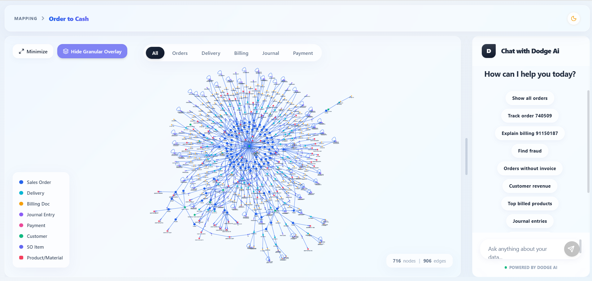
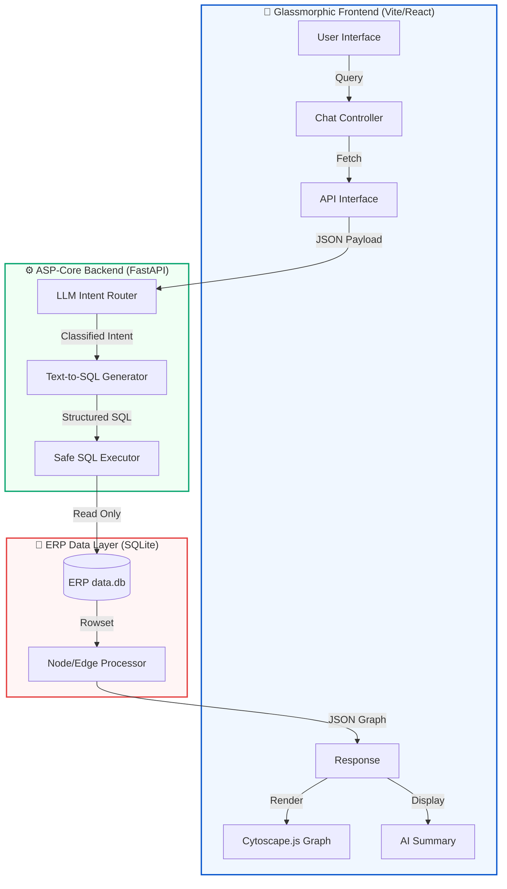

<div align="center">
  
  <h1>🚀 Dodge AI: Forward Deployed Engineer - Task Details</h1>
  <h3>Graph-Based Data Modeling and Query System</h3>
  
  <p align="center">
    
    
    
    
  </p>

  ---
  
  <p><em>"Bridging the gap between raw ERP data and actionable intelligence through schema-aware AI and high-performance graph dynamics."</em></p>
</div>

<br />

## 📸 Visual Previews

<div align="center">
  <table border="0">
    <tr>
      <td width="50%" align="center">
        
        <br /><em>Dynamic O2C Graph Visualization</em>
      </td>
      <td width="50%" align="center">
        
        <br /><em>Conversational ERP Intelligence</em>
      </td>
    </tr>
  </table>
</div>

<br />

## 🔍 Overview
Dodge AI provides a **dynamic graph visualization** and an **interactive AI chat assistant** specifically engineered for **Order-to-Cash (O2C)** SAP/ERP tabular dataset analysis. Through this interface, users can execute deep, schema-aware queries, trace complex billing flows, and pinpoint broken linkages in the supply chain with unparalleled speed.

---

## 🏗️ Architecture Decisions

### 🔩 Framework Layer: Modern Full-Stack
*   **Dual-Engine Architecture:** Utilizing a **FastAPI (Python)** backend for high-performance data processing and **React (Vite)** for a lightweight, optimized frontend. This unified approach reduces cross-origin complexity and ensures lightning-fast hot-reloading.
*   **Glassmorphic Styling:** Adhering to a "Utility-Plus" philosophy. While leveraging utility power for layout, we utilize **Vanilla CSS** for core design tokens, glassmorphism aesthetics, and rich micro-animations to achieve a state-of-the-art premium UI.

### 🕸️ Graph Ecosystem: High-Density Visualization
*   **Vectorized Graphing:** Powered by **Cytoscape.js** (and compatible with 2D force-directed layouts). This ensures an interactive, lag-free UI even when the ERP flow tree grows to hundreds of nodes, allowing users to zoom and pan through intricate Sales Order and Delivery relationships seamlessly.

### 💾 Database Choice: Why SQLite?
*   **Serverless SQL Power:** SQLite is completely serverless and extremely lightweight, yet allows for full SQL capability (CTEs, Joins, and Window Functions) natively.
*   **Mirroring ERP Reality:** Since SAP/ERP datasets are strictly relational, a local relational model like SQLite beautifully mirrors the actual data behavior. This allows the LLM's **Text-to-SQL logic** to remain realistic, robust, and ready for production upgrades.

---

## 🌟 Key Highlights

- **✨ Premium UI/UX:** Stunning **Glassmorphism Design** with smooth micro-animations and a vibrant, interactive dark/light mesh background.
- **⚡ High-Speed Graph:** Cytoscape-powered UI allows tracing document flows (Order → Delivery → Billing) effortlessly in real-time.
- **🛡️ Secure AI Guardrails:** Built-in safeguards ensure the AI strictly answers from your ERP data while preventing common injection/tampering attempts.
- **🚀 Zero-Config Deployment:** Ready-to-go monorepo architecture with an automatic API proxy for Vercel + Render hosting.

---

## 🚦 System Working Flow
The Dodge AI engine follows a sophisticated three-layer process to transform natural language into interactive ERP insights.



### 🛰️ Step-by-Step Execution Breakdown

1.  **User Input Analysis:** The frontend captures the natural language query and transmits it to the **FastAPI Intent Router**.
2.  **Intent Classification:** The LLM analyzes the query to determine if it's a **Geographic/Graph Trace** (e.g., *"Trace this order"*), a **Relational Audit** (e.g., *"Show me late shipments"*), or a **Contextual Explanation** (e.g., *"Why is this order stuck?"*).
3.  **Dynamic SQL Synthesis:** Based on the classified intent, our **Text-to-SQL Generator** builds a precise, high-performance JOIN across relational headers and items in the SQLite database.
4.  **Graph Serialization:** The backend processes the raw SQL rowsets into a **JSON Graph Object** (Nodes & Edges), calculating vibrance colors and distinct shapes for each ERP document type.
5.  **Interactive Rendering:** The **Cytoscape.js** engine renders the vectorized graph on the glassmorphic canvas, while the LLM summary provides a clean, human-readable answer in the chat panel.

---

## 🤖 LLM Prompting Strategy
To make the AI capable of answering in-depth questions (e.g., tracking a broken billing workflow), we employ a rigid **Text-to-SQL Architecture**:

1.  **System Context (Schema Mapping):** The prompt begins by defining the exact schema available (`sales_order_headers`, `billing_document_headers`, etc.) and the primary/foreign key relationships.
2.  **Intent Routing:** The AI first classifies the query. If it requires querying the ERP flow, it drafts a SQL query safely, simulating execution.
3.  **Few-Shot Examples:** Crucially for complex questions (e.g., *"Trace the full flow of billing document X"*), the AI receives few-shot prompts indicating the expected path (JOINs through items, shipments, and journals).

---

## 🛡️ Guardrails
To strictly constrain the assistant to the SAP/ERP dataset:

*   **Domain Whitelisting:** The core system prompt mandates: *"You are an AI assistant designed strictly for analyzing Order to Cash dataset metrics."* Queries unrelated to ERP order processing are tactfully refused.
*   **Read-Only Enforcements:** Any generated logic restricts mutation, providing a strict read-only data isolation layer.
*   **Null Fallbacks:** If a linkage is missing, the guardrails enforce acknowledging the break—a vital feature for pinpointing broken O2C flows.

---

## 📁 Repository Structure (Monorepo)
```text
dodge-ai/
 ├── backend/            # FastAPI (Logic, Intent Handling, SQLite)
 ├── frontend/           # React + Vite (Glassmorphic UI)
 ├── DOCS/               # deployment guides & walkthroughs
 └── sessions/           # development history & logs
```

---

## 🛠️ Setup & Deployment
- **Backend:** `cd backend && pip install -r requirements.txt && uvicorn dodge_ai:app --reload`
- **Frontend:** `cd frontend && npm install && npm run dev`
- **Live Hosting:** Optimized for **Render (Backend)** & **Vercel (Frontend)** with Zero-Config proxying.

<div align="center">
  <br/>
  <b>Live Application:</b> <a href="https://dodge-ai-graph-based-data-modeling.vercel.app">dodge-ai-graph-based-data-modeling.vercel.app</a>
  <br/>
  <i>Engineered by Dodge AI for High-Speed ERP Operational Intelligence.</i>
</div>
