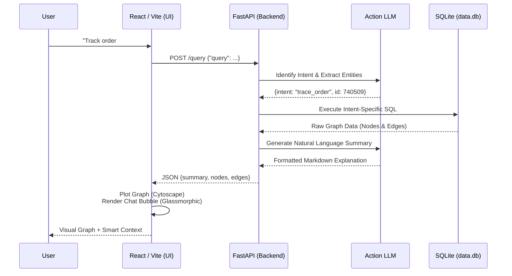

<div align="center">
  
  <h1>🚀 Dodge AI: # Forward Deployed Engineer - Task Details</h1>
  <h3>Graph-Based Data Modeling and Query System</h3>
  <p><em>A powerful, visual ERP analytics tool combining dynamic graph visualization with a conversational AI Copilot to deliver deep business intelligence into the Order-to-Cash (O2C) pipeline.</em></p>

  [](https://react.dev/)
  [](https://fastapi.tiangolo.com/)
  [](https://sqlite.org/)
  [](https://vitejs.dev/)
</div>

<br />

## ✨ Features

- **🧠 Intelligent Query Engine:** Ask questions in plain English (e.g., *"Find all stuck deliveries"* or *"Explain order 740509"*). The built-in LLM detects your exact intent, generates structured SQL, and returns human-readable summaries.
- **🕸️ Cytoscape Graph Visualization:** Every transaction is rendered dynamically on a glassmorphic canvas. See the precise relationships between Sales Orders, Deliveries, Billing Docs, and Journals.
- **🎨 Premium UI/UX:** Built with a stunning dark/light glassmorphic mesh UI that makes data analytics visually impressive.
- **🚀 Zero-Config Proxy:** A fully decoupled standard monorepo setup ready for immediate Vercel/Render deployment.

---

## 🏗️ System Architecture & Working Flow

The following sequence diagram outlines how user queries are processed and returned visually.



---

## 📁 Repository Structure (Monorepo)
Your project is now organized for professional deployment:
```
dodge-ai/
 ├── backend/            # FastAPI + SQLite
 │    ├── dodge_ai.py    # Main API
 │    ├── data.db        # Database
 │    └── requirements.txt
 └── frontend/           # React (Vite)
      ├── src/           # UI Components
      └── .env           # Environment config
```

---

## 🛠️ Setup Instructions

### 1. Local Development
#### Backend (Terminal 1)
```bash
cd backend
pip install -r requirements.txt
uvicorn dodge_ai:app --host 0.0.0.0 --port 8000 --reload
```

#### Frontend (Terminal 2)
```bash
cd frontend
npm install
npm run dev
```

### 2. Production Deployment
- **Backend:** Deploy on free tier at **Render.com** (Root: `backend`, Command: `uvicorn dodge_ai:app --host 0.0.0.0 --port $PORT`).
- **Frontend:** Deploy on **Vercel** (Root: `frontend`, Framework: `Vite`).
- **API Connectivity:** The provided `vercel.json` automatically proxies `/api/*` network calls securely to the Render backend!

---

## 🔗 Project Links
- [GitHub Repository](https://github.com/Tanishq-Raj/Dodge-AI-Graph-Based-Data-Modeling-and-Query-System.git)

<div align="center">
  <br/>
  <i>Engineered for unparalleled ERP operational intelligence.</i>
</div>
